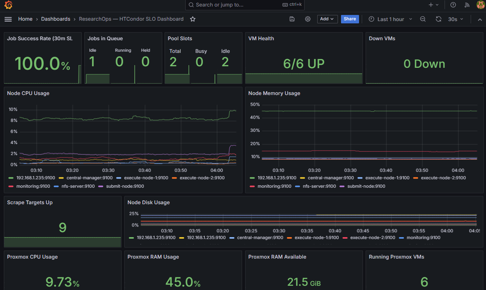
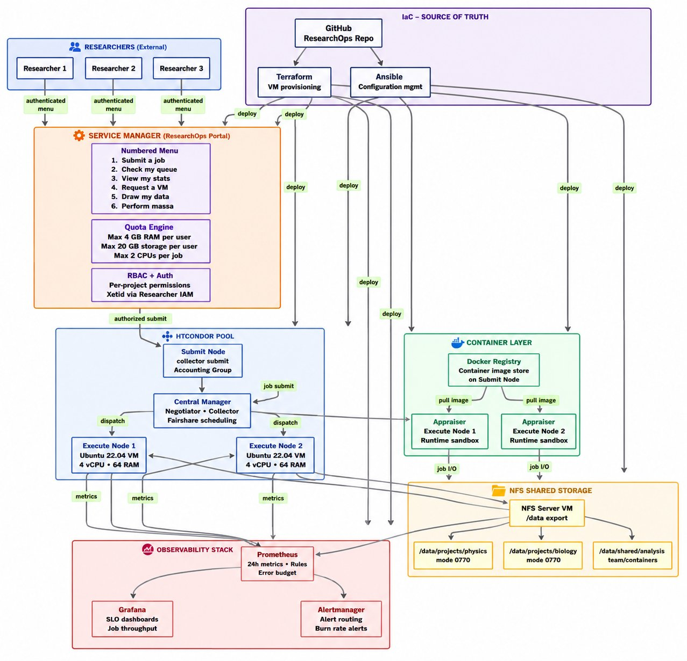
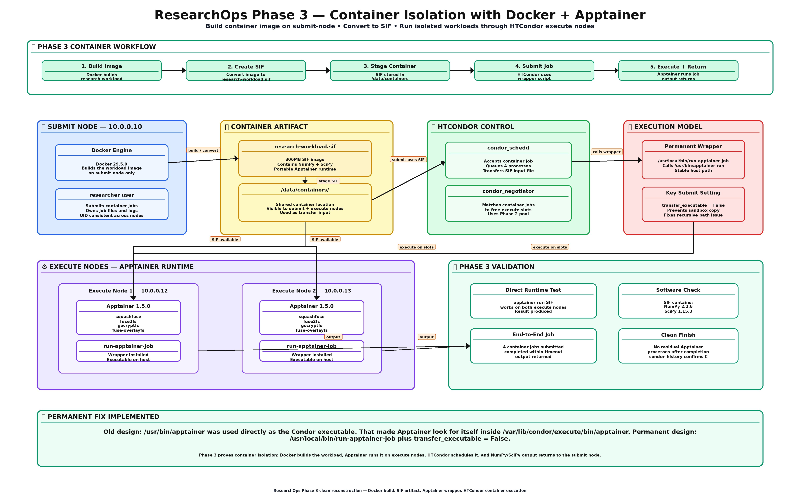
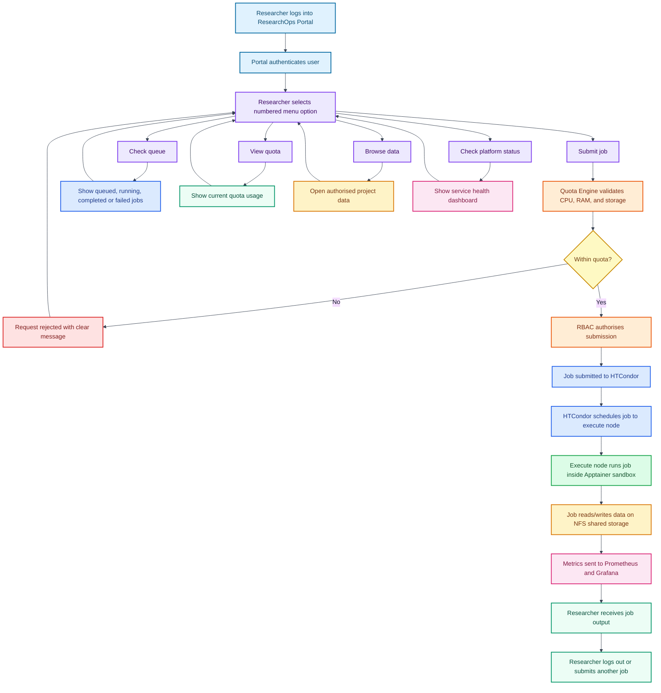

# ResearchOps

**Self-Hosted Research Compute Platform — Proof of Concept Sandbox**

> HTCondor · Apptainer · NFS · Prometheus · Grafana · Terraform · Ansible · Proxmox VE

[](https://github.com/adeolu-rabiu/ResearchOps)
[](https://github.com/adeolu-rabiu/ResearchOps)
[](https://github.com/adeolu-rabiu/ResearchOps)
[](https://github.com/adeolu-rabiu/ResearchOps)
[](https://github.com/adeolu-rabiu/ResearchOps)
[](https://github.com/adeolu-rabiu/ResearchOps)
[](https://github.com/adeolu-rabiu/ResearchOps)
[](LICENSE)

---

## Live Dashboard

> **ResearchOps is running live on bare-metal Proxmox VE.**
> The Grafana SLO dashboard below reflects real-time platform health.

[](https://rabtech.tailb41b25.ts.net/d/researchops-slo/researchops-e28094-htcondor-slo-dashboard?orgId=1&refresh=30s)



*Dashboard showing: 100% job success rate · 6/6 VMs UP · 9 scrape targets · 2 HTCondor execute slots · NFS 93.7 GiB free · Proxmox host metrics live*

---

## What Is ResearchOps?

ResearchOps is a fully self-hosted, Infrastructure-as-Code research compute platform built on a bare-metal Proxmox VE hypervisor. It provisions six purpose-built Linux VMs to deliver a production-grade HTCondor high-throughput computing pool, with:

- **Apptainer container sandboxing** for untrusted workloads
- **NFS shared storage** with per-project data isolation (OS-enforced)
- **Researcher self-service portal** with quota enforcement and audit logging
- **Full SRE observability** — Prometheus SLIs, Grafana dashboards, Alertmanager Slack alerts

> Zero manual deployment. Every VM, every config, every service is provisioned by code.
> A single `git clone && make apply && make provision` rebuilds the entire platform from scratch.

---

## Remote Demo Access

Platform is remotely accessible via [Tailscale](https://tailscale.com) from any network including UoM campus.

### One-command tunnel (SSH required)

```bash
ssh -N   -L 3000:10.0.0.15:3000   -L 9090:10.0.0.15:9090   root@100.122.5.126

# Then open:
# http://localhost:3000  → Grafana  (admin / htcondorsre)
# http://localhost:9090  → Prometheus
```

---

## Architecture



*Full platform architecture — GitHub as IaC source of truth, Terraform + Ansible deployment, HTCondor pool, Apptainer sandboxing, NFS storage, and Prometheus observability stack*

---

## Phase 3 — Container Isolation Detail



*Phase 3 detail — Docker builds the SIF image on submit-node, HTCondor transfers it to execute nodes, Apptainer runs it in a rootless sandbox, output returns to the researcher*

---

## Researcher Journey



*Researcher journey — from SSH login through the Service Manager portal, quota enforcement, HTCondor scheduling, Apptainer container execution, NFS data access, and Prometheus observability*

---

## Value Proposition

| Challenge | ResearchOps Solution |
|-----------|---------------------|
| Self-service | Researchers submit jobs via a numbered menu portal. No HTCondor knowledge required. |
| Fair-use | HTCondor accounting groups enforce hard per-group CPU quotas. One team cannot starve another. |
| Data control | NFS per-project directories with mode 0770. Cross-project access blocked at OS level. |
| Security | Apptainer rootless sandboxing. Untrusted code runs inside a container. Cannot touch host OS. |
| Monitoring | Prometheus SLIs, 30-day error budget, Grafana dashboards, Alertmanager Slack alerts. |
| Sandboxing | Every job runs inside an Apptainer SIF container. No bare-metal execution permitted. |

---

## Cost Efficiency — Self-Hosted vs Cloud

| Component | AWS Equivalent | Monthly (USD) |
|-----------|---------------|---------------|
| Submit node (2vCPU/2GB) | t3.small | $17 |
| Central manager (2vCPU/2GB) | t3.small | $17 |
| Execute node 1 (4vCPU/4GB) | t3.xlarge | $121 |
| Execute node 2 (4vCPU/4GB) | t3.xlarge | $121 |
| NFS server + 100GB storage | t3.micro + EFS | $38 |
| Monitoring (2vCPU/2GB) | t3.small | $17 |
| **Total AWS** | | **~$346/month** |
| **Self-hosted (power + amortisation)** | | **~£48/month** |
| **Saving** | | **~89% cost reduction** |

---

## SLO / SLI Framework

| SLI | Target | Error Budget (30d) |
|-----|--------|--------------------|
| Job submission success rate | >= 99.5% | 3h 36m |
| Execute node availability | >= 99% | 7h 12m |
| NFS /data availability | >= 99.9% | 43 minutes |
| Monitoring stack uptime | >= 99% | 7h 12m |
| Quota enforcement accuracy | 100% | Zero tolerance |

---

## VM Inventory

| VM | IP | Role | vCPU | RAM | Disk |
|----|----|------|------|-----|------|
| submit-node | 10.0.0.10 | condor_schedd, Service Manager, Docker | 2 | 5 GB | 20 GB |
| central-manager | 10.0.0.11 | HTCondor Negotiator + Collector | 2 | 5 GB | 20 GB |
| execute-node-1 | 10.0.0.12 | condor_startd + Apptainer sandbox | 4 | 6 GB | 40 GB |
| execute-node-2 | 10.0.0.13 | condor_startd + Apptainer sandbox | 4 | 6 GB | 40 GB |
| nfs-server | 10.0.0.14 | NFS /data export, per-project dirs | 1 | 5 GB | 100 GB |
| monitoring | 10.0.0.15 | Prometheus, Grafana, Alertmanager | 2 | 5 GB | 20 GB |

---

## Quick Start

```bash
git clone git@github.com:adeolu-rabiu/ResearchOps.git
cd ResearchOps

make init        # Initialise Terraform providers
make plan        # Preview infrastructure changes
make apply       # Provision all 6 VMs on Proxmox
make provision   # Configure all services via Ansible
make test-all    # Verify everything is healthy
```

---

## Build Phases

| Phase | Description | Status |
|-------|-------------|--------|
| 0 | IaC scaffold, GitHub repo, tools installation | ✅ Complete |
| 1 | Terraform VM provisioning — all 6 VMs from code | ✅ Complete |
| 2 | HTCondor pool — Central Manager, Submit, Execute nodes | ✅ Complete |
| 3 | Apptainer + Docker — container isolation layer | ✅ Complete |
| 4 | NFS shared storage — per-project data isolation | ✅ Complete |
| 5 | Prometheus + Grafana + SLO rules — full observability | ✅ Complete |
| 6 | Service Manager — researcher portal with quota enforcement | ✅ Complete |
| 7 | Chaos engineering + DR runbook — resilience tested | 🔄 Planned |
| 8 | IaC seal — full rebuild from zero verified | ⏳ Pending |

Each phase has a documented test suite in `tests/` and a dedicated git commit. No phase is declared complete until all tests pass.

---

## Stack

| Layer | Technology | Purpose |
|-------|-----------|---------|
| Hypervisor | Proxmox VE 9.1.9 | Bare-metal VM host, cloud-init templating |
| Compute scheduler | HTCondor 23.x | Job queuing, dispatch, fair-use scheduling |
| Job sandboxing | Apptainer 1.5 | Rootless container runtime |
| Image building | Docker 29.5 | Build Apptainer SIF images |
| Shared storage | NFS v4 | Per-project /data with OS-enforced isolation |
| Self-service portal | ResearchOps Service Manager | Numbered menu, quota enforcement, audit log |
| VM provisioning | Terraform 1.7 + bpg/proxmox | All 6 VMs defined as code |
| Configuration mgmt | Ansible 9 | Idempotent roles for every service |
| Metrics collection | Prometheus 2.51 | SLI recording rules, 30-day retention |
| Dashboards | Grafana 10.4 | SLO error budget, job throughput, node health |
| Alerting | Alertmanager 0.27 | Slack routing, burn-rate alerts |
| Remote access | Tailscale | Secure mesh VPN, Funnel for public demo URL |

---

## Makefile Targets

```bash
make init          # Initialise Terraform providers
make plan          # Preview infrastructure changes
make apply         # Provision all VMs
make destroy       # Tear down all VMs
make provision     # Run full Ansible playbook
make backup        # Sync primary to 2TB replica drive
make test-all      # Run all phase test suites
make chaos-1       # Execute node failure test
make chaos-2       # NFS failure test
make chaos-3       # Quota bypass test
make dr            # Full disaster recovery rebuild
```

---

## Industry Best Practices

| Practice | Implementation |
|----------|---------------|
| SRE — SLO/SLI/Error Budget | Prometheus recording rules track job success rate, node availability, NFS health |
| Infrastructure as Code | Terraform provisions all VMs. Ansible configures every service. No config outside git. |
| Chaos Engineering | Scripted fault injection: execute node failure, NFS failure, quota bypass |
| Disaster Recovery | DR runbook rebuilds platform from git clone in under 30 minutes |
| GitOps | Every deployment triggered by a git commit. No SSH-and-type. No click-ops. |
| Observability First | Monitoring deployed before chaos tests. SLOs defined before infrastructure is built. |
| Least Privilege | SSH key auth only. Researchers access portal only. No shell access to execute nodes. |

---

## Contact

**Adeolu Rabiu** — Cloud Infrastructure Engineer | Linux Systems Administrator | SRE

[](https://linkedin.com/in/adeolurabiu)
[](https://github.com/adeolu-rabiu)

---

*ResearchOps — Proof of Concept Sandbox. Self-hosted research compute, built with IaC, operated with SRE discipline.*
