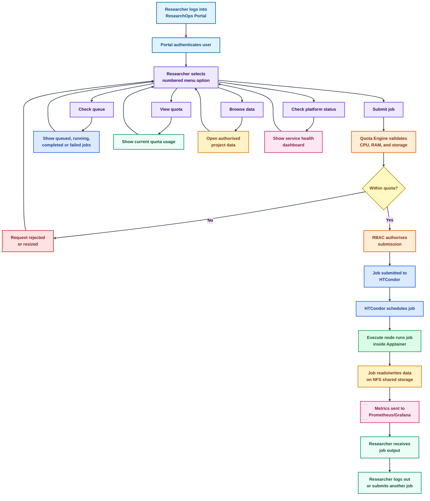

<div align="center">

# ResearchOps

### Self-Hosted Research Compute Platform — Proof of Concept Sandbox

*HTCondor · Apptainer · NFS · Prometheus · Terraform · Ansible · Proxmox VE*

---


</div>

---

## What Is ResearchOps?

ResearchOps is a **fully self-hosted, Infrastructure-as-Code research compute platform**
built on a bare-metal Proxmox VE hypervisor. It provisions six purpose-built Linux VMs
to deliver a production-grade HTCondor high-throughput computing pool, with Apptainer
container sandboxing for untrusted workloads, NFS shared storage with per-project data
isolation, a researcher self-service portal, and full SRE observability.

This is a **proof of concept sandbox** demonstrating how research compute infrastructure
can be delivered at scale, securely, and cost-efficiently without dependence on public
cloud providers.

> **Zero manual deployment.** Every VM, every config, every service is provisioned by
> code. A single `git clone && make apply && make provision` rebuilds the entire platform
> from scratch.

---

## Architecture


---

## Value Proposition

ResearchOps addresses six core challenges of providing computing resources at scale
for bespoke and untrusted research workloads.

| Challenge | ResearchOps Solution |
|-----------|---------------------|
| **Self-service** | Researchers submit jobs via a numbered menu portal. No HTCondor knowledge required. Day one productivity. |
| **Fair-use** | HTCondor accounting groups enforce hard per-group CPU quotas. One team cannot starve another. |
| **Data control** | NFS per-project directories with mode `0770`. Cross-project access is blocked at the OS level. |
| **Security** | Apptainer rootless sandboxing. Untrusted code runs inside a container and cannot touch the host OS. |
| **Monitoring** | Prometheus SLIs, 30-day error budget tracking, Grafana dashboards, Alertmanager burn-rate alerts. |
| **Sandboxing** | Every job runs inside an Apptainer SIF container on the execute node. No bare-metal execution permitted. |

### Industry Best Practices Implemented

| Practice | Implementation |
|----------|---------------|
| **SRE — SLO/SLI/Error Budget** | Prometheus recording rules track job success rate, node availability, NFS health. Error budget burn alerts fire before SLO breach. |
| **Infrastructure as Code** | Terraform provisions all 6 VMs. Ansible configures every service. No configuration exists outside git. |
| **Chaos Engineering** | Scripted fault injection tests: execute node failure, NFS failure, quota bypass attempts. All pass before phase is declared complete. |
| **Disaster Recovery** | Full DR runbook rebuilds the platform from `git clone` in under 30 minutes. RTO tested and documented. |
| **GitOps** | Every deployment is triggered by a git commit. No SSH-and-type. No click-ops. |
| **Immutable Infrastructure** | VMs are rebuilt from a clean Ubuntu 22.04 cloud-init template on every `make apply`. Nothing is patched in place. |
| **Observability First** | Monitoring deployed before chaos tests. SLOs defined before infrastructure is built. |
| **Least Privilege** | SSH key authentication only. Researchers access the portal only. No researcher has shell access to execute nodes. |

---

## Cost Efficiency — Self-Hosted vs Cloud

ResearchOps runs on existing bare-metal hardware. The table below compares the
equivalent monthly cost if the same platform were hosted on AWS.

### Equivalent AWS Cost (6 VMs + storage)

| Component | AWS Equivalent | Monthly Cost (USD) |
|-----------|---------------|-------------------|
| Submit node (2vCPU/2GB) | t3.small On-Demand | $17 |
| Central manager (2vCPU/2GB) | t3.small On-Demand | $17 |
| Execute node 1 (4vCPU/4GB) | t3.xlarge On-Demand | $121 |
| Execute node 2 (4vCPU/4GB) | t3.xlarge On-Demand | $121 |
| NFS server (1vCPU/1GB) | t3.micro + EFS 100GB | $38 |
| Monitoring (2vCPU/2GB) | t3.small On-Demand | $17 |
| Data transfer (est.) | Outbound egress | $15 |
| **Total AWS** | | **~$346/month** |
| **Annual AWS** | | **~$4,152/year** |

### Self-Hosted on Proxmox VE

| Component | Cost | Monthly Cost (GBP) |
|-----------|------|--------------------|
| Hardware amortised (3yr) | Existing server | ~£18 |
| Power (150W avg, 24/7) | 28p/kWh UK avg | ~£30 |
| Network (home/lab fibre) | Existing connection | £0 |
| **Total self-hosted** | | **~£48/month** |
| **Annual self-hosted** | | **~£576/year** |

> **Estimated saving: ~89% cost reduction vs public cloud.**
> At scale, the gap widens further. A research institution running this platform
> for a 12-month pilot saves approximately **£3,000–£3,500** compared to the
> equivalent AWS spend. The only variable cost is power.

---

## Functional Requirements

| ID | Requirement | Implemented By |
|----|-------------|----------------|
| FR-01 | Researchers must be able to submit HTC jobs without knowing HTCondor commands | Service Manager portal |
| FR-02 | No single researcher may consume more than 4 GB RAM or 2 CPUs per job | Quota Engine + HTCondor accounting groups |
| FR-03 | No researcher may store more than 20 GB in their project directory | NFS quota + Service Manager check |
| FR-04 | Untrusted job payloads must run in an isolated container and cannot access host OS | Apptainer rootless sandbox |
| FR-05 | Research project data must not be accessible across project boundaries | NFS per-project dirs, mode 0770, OS-enforced |
| FR-06 | The platform must recover from a single execute node failure without data loss | HTCondor job rescheduling, chaos test verified |
| FR-07 | All infrastructure must be deployable from a single git repository with no manual steps | Terraform + Ansible IaC |
| FR-08 | Platform health must be visible in real time via a monitoring dashboard | Prometheus + Grafana |
| FR-09 | Alerts must fire within 60 seconds of a critical component failure | Alertmanager, chaos test verified |
| FR-10 | Full platform must be restorable from zero in under 30 minutes | DR runbook, tested |
| FR-11 | All researcher actions must be logged for audit purposes | Service Manager audit log to `/data/logs/` |
| FR-12 | Job scheduling must enforce per-group CPU fairness across research teams | HTCondor GROUP_QUOTA accounting groups |

---

## Researcher Journey

The following diagram shows the complete flow from researcher login to job completion
and output retrieval.



---

## SLO / SLI Framework

SLOs are defined before the platform is built and instrumented as Prometheus
recording rules from Phase 5 onwards. Error budgets use a 30-day rolling window.

| SLI | SLO Target | Error Budget (30d) | Alert Threshold |
|-----|------------|--------------------|-----------------|
| Job submission success rate | >= 99.5% | 3h 36m | Fast burn: 2% in 1h |
| Job scheduling latency p95 | <= 30 seconds | Latency SLO | > 30s for 5 min |
| Execute node availability | >= 99% | 7h 12m | Node down > 2 min |
| NFS /data availability | >= 99.9% | 43 minutes | Down > 60 sec |
| Monitoring stack uptime | >= 99% | 7h 12m | Prometheus unreachable |
| Quota enforcement accuracy | 100% | Zero tolerance | Any bypass = critical |

---

## Quick Start

```bash
# Clone the repo
git clone git@github.com:adeolu-rabiu/ResearchOps.git
cd ResearchOps

# Step 1 — Initialise Terraform providers
make init

# Step 2 — Review what will be provisioned
make plan

# Step 3 — Provision all 6 VMs on Proxmox
make apply

# Step 4 — Configure all services via Ansible
make provision

# Step 5 — Verify everything is healthy
make test-all
```

---

## VM Inventory

All VMs provisioned on **Proxmox VE (rabtech)** — 40GB RAM host, 843GB primary storage.

| VM | IP | Role | vCPU | RAM | Disk |
|----|----|------|------|-----|------|
| submit-node | 10.0.0.10 | condor_submit, Service Manager, Docker | 2 | 2 GB | 20 GB |
| central-manager | 10.0.0.11 | HTCondor Negotiator + Collector | 2 | 2 GB | 20 GB |
| execute-node-1 | 10.0.0.12 | condor_startd + Apptainer sandbox | 4 | 4 GB | 40 GB |
| execute-node-2 | 10.0.0.13 | condor_startd + Apptainer sandbox | 4 | 4 GB | 40 GB |
| nfs-server | 10.0.0.14 | NFS /data export, per-project dirs | 1 | 1 GB | 100 GB |
| monitoring | 10.0.0.15 | Prometheus, Grafana, Alertmanager | 2 | 2 GB | 20 GB |
| **Total** | | | **15 vCPU** | **15 GB** | **240 GB** |

---

## Stack

| Layer | Technology | Purpose |
|-------|-----------|---------|
| Hypervisor | Proxmox VE 8 | Bare-metal VM host, cloud-init templating |
| Compute scheduler | HTCondor 23.x | Job queuing, dispatch, fair-use scheduling |
| Job sandboxing | Apptainer 1.2 | Rootless container runtime for untrusted workloads |
| Image building | Docker + Registry | Build and store Apptainer SIF images |
| Shared storage | NFS v4 | Per-project /data with OS-enforced isolation |
| Self-service portal | ResearchOps Service Manager | Numbered menu, quota enforcement, RBAC, audit log |
| VM provisioning | Terraform 1.7 + telmate/proxmox | All 6 VMs defined as code |
| Configuration mgmt | Ansible 9 | Idempotent roles for every service on every VM |
| Metrics collection | Prometheus 2.x | SLI recording rules, 30-day retention |
| Dashboards | Grafana | SLO error budget, job throughput, node health |
| Alerting | Alertmanager | Burn-rate routing, severity grouping |
| Source of truth | GitHub | Every deploy starts from a git commit |

---

## Dashboards

| Dashboard | URL | Credentials |
|-----------|-----|-------------|
| Grafana | http://10.0.0.15:3000 | admin / htcondorsre |
| Prometheus | http://10.0.0.15:9090 | — |
| Alertmanager | http://10.0.0.15:9093 | — |

---

## Build Phases

| Phase | Description | Status |
|-------|-------------|--------|
| 0 | IaC scaffold, GitHub repo, tools installation | ✅ Complete |
| 1 | Terraform VM provisioning — all 6 VMs from code | 🔄 In progress |
| 2 | HTCondor pool — Central Manager, Submit, Execute nodes | ⏳ Pending |
| 3 | Apptainer + Docker — container isolation layer | ⏳ Pending |
| 4 | NFS shared storage — per-project data isolation | ⏳ Pending |
| 5 | Prometheus + Grafana + SLO rules — full observability | ⏳ Pending |
| 6 | Service Manager — researcher portal with quota enforcement | ⏳ Pending |
| 7 | Chaos engineering + DR runbook — resilience tested | ⏳ Pending |
| 8 | IaC seal — full rebuild from zero verified | ⏳ Pending |

Each phase has a documented test checklist in `docs/phases/phase-N/`
and a dedicated git commit. No phase is declared complete until all
tests pass and the backup to the 2TB replica drive is verified.

---

## Chaos Engineering

Three scripted fault injection tests prove the platform absorbs failures
within SLO before the platform is declared production-ready.

```bash
make chaos-1   # Kill execute node mid-job — verify rescheduling < 5 min
make chaos-2   # Kill NFS storage — verify alert fires < 60 seconds
make chaos-3   # Attempt quota bypass — verify blocked by both portal and HTCondor
```

---

## Disaster Recovery

```bash
make dr
# Destroys all 6 VMs
# Rebuilds from Terraform + Ansible
# Validates condor_status, NFS mounts, Prometheus targets
# Target RTO: < 30 minutes
```

---

## Storage

| Location | Drive | Purpose |
|----------|-------|---------|
| `/mnt/vmdata/researchops` | 1TB (843GB free) | Primary project storage |
| `/mnt/datastore2tb/researchops-backup` | 2TB (1.7TB free) | Rsync replica, synced after every phase commit |

```bash
make backup   # rsync primary → replica, run after every git push
```

---

## Makefile Targets

```bash
make init          # Initialise Terraform providers
make plan          # Preview infrastructure changes
make apply         # Provision all VMs
make destroy       # Tear down all VMs
make provision     # Run full Ansible playbook
make backup        # Sync primary to 2TB replica drive
make test-ping     # Ansible ping all 6 VMs
make test-condor   # condor_status on central manager
make test-all      # Run all health checks
make chaos-1       # Execute node failure test
make chaos-2       # NFS failure test
make chaos-3       # Quota bypass test
make dr            # Full disaster recovery rebuild
```

---

## Contact

**Adeolu Rabiu** — Cloud Infrastructure Engineer | Linux Systems Administrator | SRE

- LinkedIn: [linkedin.com/in/adeolurabiu](https://linkedin.com/in/adeolurabiu)
- GitHub: [github.com/adeolu-rabiu](https://github.com/adeolu-rabiu)
- Email: adeolu.rabiu@gmail.com
- Phone: +44 7578 928 667

---

<div align="center">

*ResearchOps — Proof of Concept Sandbox*
*Self-hosted research compute, built with IaC, operated with SRE discipline.*


</div>
